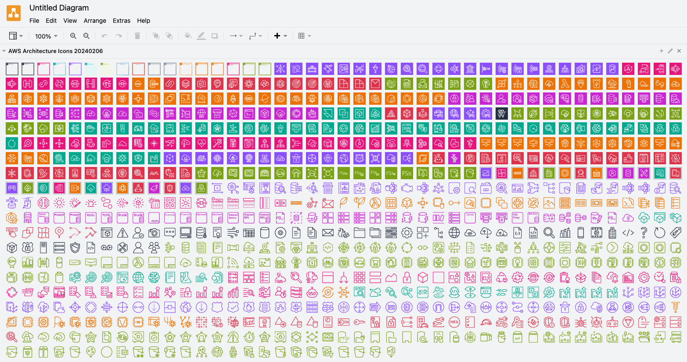

# diagrams.net AWS Architecture Icons

## What is it?

Shapes library with [AWS Architecture Icons](https://aws.amazon.com/architecture/icons/)
for [diagrams.net](https://diagrams.net/)
([formerly draw.io](https://www.diagrams.net/blog/move-diagrams-net)) application.

Load it into diagrams.net in one of the following ways:

- **easiest:** [click here to add the library to diagrams.net](https://app.diagrams.net/?splash=0&clibs=Uhttps://raw.githubusercontent.com/m-radzikowski/diagrams-aws-icons/master/20240206/AWS%20Architecture%20Icons%2020240206.xml)
  (may take few seconds to load)
- **manual with link** (for example to diagrams.net on Atlassian Confluence):
  select File → Open Library from → URL and put
  `https://raw.githubusercontent.com/m-radzikowski/diagrams-aws-icons/master/20240206/AWS Architecture Icons 20240206.xml`
- **manual with file:** download particular `.xml` file and [open it in application](https://www.diagrams.net/blog/custom-libraries)



## How it's different from the built-in AWS shapes library?

- more up-to-date
- shapes have connection points
- shapes size is 50x50 px instead of 78x78 px
  (I found it much more suitable personally)
- single library with all the icons

## Previous versions

- [2023-04-28](https://app.diagrams.net/?splash=0&clibs=Uhttps://raw.githubusercontent.com/m-radzikowski/diagrams-aws-icons/master/20230428/AWS%20Architecture%20Icons%2020230428.xml)
- [2023-01-31](https://app.diagrams.net/?splash=0&clibs=Uhttps://raw.githubusercontent.com/m-radzikowski/diagrams-aws-icons/master/20230131/AWS%20Architecture%20Icons%2020230131.xml)
- [2022-07-31](https://app.diagrams.net/?splash=0&clibs=Uhttps://raw.githubusercontent.com/m-radzikowski/diagrams-aws-icons/master/20220731/AWS%20Architecture%20Icons%2020220731.xml)
- [2022-04-30](https://app.diagrams.net/?splash=0&clibs=Uhttps://raw.githubusercontent.com/m-radzikowski/diagrams-aws-icons/master/20220430/AWS%20Architecture%20Icons%2020220430.xml)
- [2021-09-17](https://app.diagrams.net/?splash=0&clibs=Uhttps://raw.githubusercontent.com/m-radzikowski/diagrams-aws-icons/master/20210917/AWS%20Architecture%20Icons%2020210917.xml)
- [2020-09-11](https://app.diagrams.net/?splash=0&clibs=Uhttps://raw.githubusercontent.com/m-radzikowski/diagrams-aws-icons/master/20200911/AWS%20Architecture%20Icons.xml)

## Generating library

Icons library is generated using [icons-asset-generator](https://github.com/m-radzikowski/icons-asset-generator):

```bash
poetry run icons-asset-generator \
    --filename-includes _48 \
    --filename-excludes Dark \
    --image-name-remove Light Arch_ Arch- Res_ _48 . - _  \
    --library-name-remove  . - _ \
    --path "./Asset-Package/" \
    diagrams.net \
    --size height=50
```

Merge it with the groups library:

```bash
# read skipping first and last line, remove newlines and multiple spaces
groups=$(sed '1d;$d' ./manual/Groups.xml | tr -d '\n' | tr -s ' ')
icons=$(cat icons.xml)
{ echo ${icons:0:12}; echo $groups; echo ","; echo ${icons:12} } | tr -d '\n' > icons-with-groups.xml
```

## Copyright

All rights to the icons belong to Amazon Web Services.
